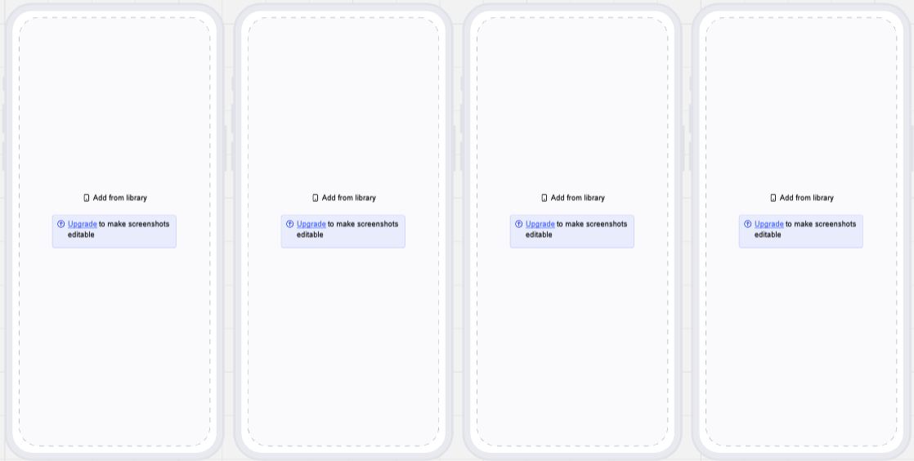
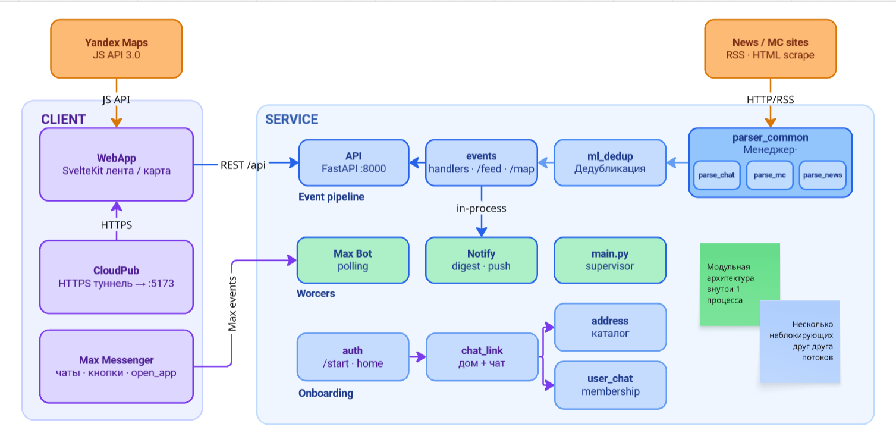
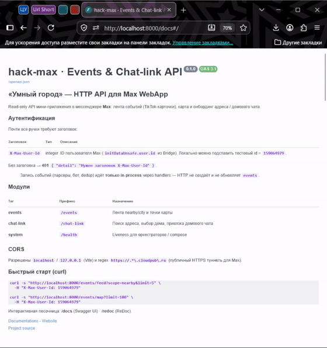

# Касается Меня


## Назначение решения 

Каждый житель хочет получать информацию о том, что происходит вокруг, 1 раз, но не потерять никакую. Для этого мы представляем решение в виде Уведомлений, Суммаризатора чатов, Информационной ленты. Более 500тысяч чатов уже создано и в каждый можно внедрить эти технологии. 

## Запуск решения

| Контейнер | Порты  | Описание                                                                                      |
|-----------|--------|-----------------------------------------------------------------------------------------------|
| postgres  | `5432` | База данных, хранящая адреса, бизнесс сущности, курсоры для парсеров.                         |
| bot       | `8000` | Бот, `API`, парсеры, воркеры уведомлений в одном процессе OS, но в разных потоках.            |
| webapp    | `5173` | Web приложение для бота, содержащие только пользовательский интерфейс.                        |
| cloudpub  |        | Тунель для возможности обращения `domain -> localhsot`, т.е `Локальный Web -> Web для макса`. |

Для запуска решения требуется `.env` файл со следующим содержанием ([.env.example](./.env.example)):

```dotenv
APP_ENVIRONMENT=prod
# Секреты и локальные переопределения конфигурации.
MAX_BOT_TOKEN=...
CLOUDPUB_TOKEN=...
AITUNNEL_API_KEY=...
```

Для запуска достаточно выполнить команду (решение атомарно для любого типа остановки и перезапуска):

```commandline
docker compose -f docker-compose.prod.yaml --env-file .env up -d
```

При запуске решения будут использованы следующие зависимости:

- [pyproject.toml](./pyproject.toml) — зависимости Python
  Где основными являются: `fastapi`, `sqlalchemy`, `onnxruntime`
- [package-lock.json](./webapp/package-lock.json) — зависимости Node.js
  Где основным является: `sveltekit`, `tailwindcss`, `typescript`

## Тестовые данные и Ограничения

<table>
<tr>
<td width="20%" valign="top" align="center">
  
  <br>
  <sub><a href="https://max.ru/join/UO3tG6zt7eEQvjqZ5xbAU1ofQTL3bzvzqObFIzFmC_U">Или по ссылке →</a></sub>
</td>
<td width="80%" valign="top">

Все тестовые данные после запуска контейнеров уже используются. Для тестирования решения были заготовлены:

- Адреса _для Москвы и её области_ для `postgres` в [addresses.csv.gz](docker/postgres/seed/addresses.csv.gz) 
- События, заранее залитые и пропущенные через ML-модели, для `postgres` в [events.jsonl.gz](docker/postgres/seed/events.csv.gz). Все события были получены **НЕ РУЧНЫМ трудом**, а через программный код парсеров, запускаемых вместе с ботом MAX. Выгрузка за небольшой промежуток времени, из-за чего лента _может казаться скудной_, но из-за богатства источников в настоящем runtime будет появляться много событий.
- Чат соседей _с имитацией общения_ в [`MAX`](https://max.ru/join/UO3tG6zt7eEQvjqZ5xbAU1ofQTL3bzvzqObFIzFmC_U). \
  Присоединитесь к чату, например, по QR-коду слева.

</td>
</tr>
</table>

## Пользовательские сценарии

...Изображение во всю ширину с вертикальными скринами
...Изображение вертикальное с видео сценария, справа текст описывающий сценарий

### Добавление бота через чат соседей



...упомянуть суммаризацию

### Добавление бота в ваш чат


...будучи админом
...удалить потом этот чат

### Просмотр новостной ленты


...уточнить, что новости старые потому что бот не парсил очень долгое время
...понтануться, что у нас есть дедубликация

### Просмотр уведомлений


...в будующем стоит сделать настройку
...перепуш уведомлений

## Архитектура

Использовалась модульная архитектура, в будующем легко будет перейти на микросервисную.



- Для ML моделей была выбрана легкая языковая модель `RuBERT-tiny2`, которую мы fine-tunel. В реальных проектах следует использовать кастомные или более сложные LLM.
- Сейчас работа с большими данными от парсеров и работа по обогащению новостей проводится in-memory, в продовых условиях следует использовать `Kafka` очередь, ведь мы не хотим терять новости и хотим держать высокий rps.
- Для geo определения выбран `spaCy` из-за простой натсройки. Канечно для настоящих ML инженеров натренеровать графовую модель более чем возможно, но не в рамках 14 дней.
- Для хранения используется `postgres`, его на реальных данных и rps может не хватить, как графовой базы данных.

## OpenAPI

Посмотреть текущее UI для Swagger можно пу пути [`/docs`](http://localhost:8000/docs) или в файле [`openapi.json`](http://localhost:8000/openapi.json). API используется только для передачи информации от бота к `webapp`. 

Для примера предлагаем следующие запросы, которые можно выполнить через Swagger UI:

| # | Метод и путь                                                                                                         | Зачем дергать           | Ожидание                                                |
|---|----------------------------------------------------------------------------------------------------------------------|-------------------------|---------------------------------------------------------|
| 1 | <span style="background:#28a745;color:#ffffff;font-weight:700">GET</span> `/health`                                  | Процесс API жив         | `{"status":"ok"}`                                       |
| 2 | <span style="background:#28a745;color:#ffffff;font-weight:700">GET</span> `/events/feed?scope=city&limit=5`          | Городская лента из seed | `200`, `scope=city`, в `items` есть карточки            |
| 3 | <span style="background:#28a745;color:#ffffff;font-weight:700">GET</span> `/events/map?limit=50`                     | Точки карты             | `200`, `count` > 0, у точек есть `lat`/`lon`/`category` |
| 4 | <span style="background:#28a745;color:#ffffff;font-weight:700">GET</span> `/chat-link/addresses/search?q=Варшавское` | Каталог адресов         | `200`, непустой `items` с `address_text`                |


