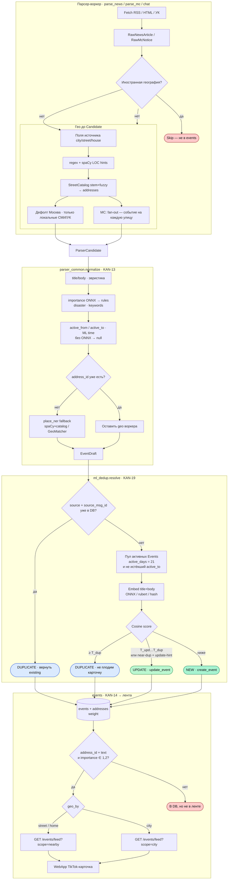

# Пайплайн: парсер → Events → лента

Та же схема, что в [`pipeline_parser_to_feed.puml`](./pipeline_parser_to_feed.puml), в **Mermaid**.

| Исход | Смысл |
|-------|--------|
| **NEW** | новое событие в `events` |
| **UPDATE** | актуализация (устранение причины, продление…) |
| **DUPLICATE** | та же новость — без новой карточки |
| **Skip** | иностранная география |
| **В DB, не в ленте** | нет адреса или `importance=3` |
