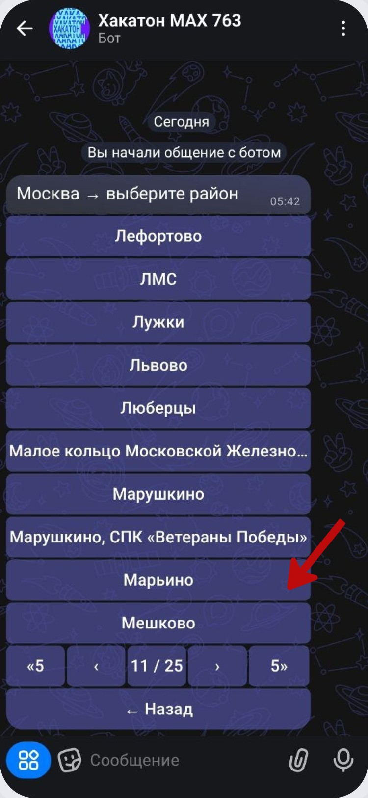

# Выбор адреса по списку

Способ **«Выбрать адрес»** удобен, когда известны район, улица и номер дома. Бот ведёт по адресу последовательно и не требует ручного ввода.

Сначала выберите город. В текущем сценарии доступна Москва.

После этого выберите район. Длинные списки разбиты на страницы: снизу есть стрелки перехода, номер текущей страницы и быстрые переходы на несколько страниц.

Далее бот показывает улицы выбранного района. Нажмите на нужную улицу.

Последний шаг - номер дома. Если домов много, список также разбивается на страницы.

После выбора дома сервис показывает результат. Если к адресу уже есть доступный домовой чат, он появляется в списке и его можно выбрать для привязки.

Если чат ещё не подключён, сервис предлагает два варианта: скопировать приглашение для администратора или продолжить подключение самостоятельно как администратор.

Если вы администратор, переходите к разделу [«Подготовка домового чата»](admin-setup.md). Если чат уже найден, переходите к [привязке адреса](admin-bind.md).
