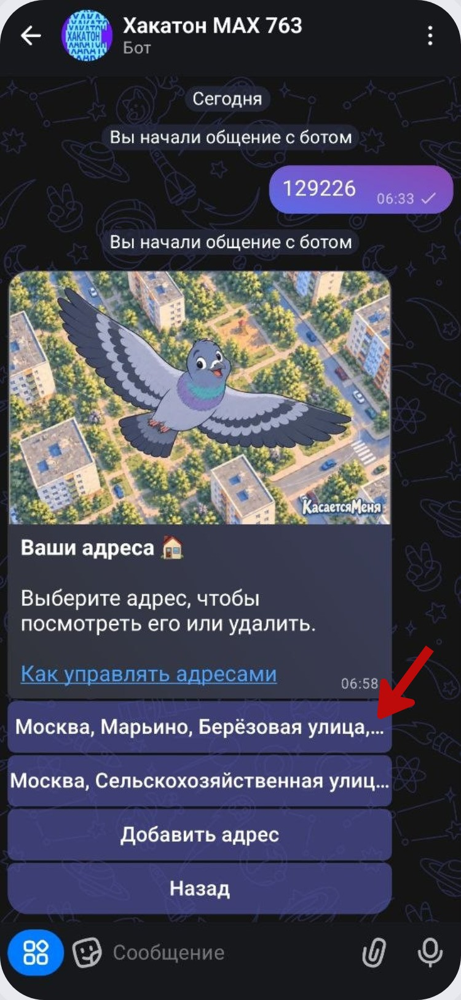
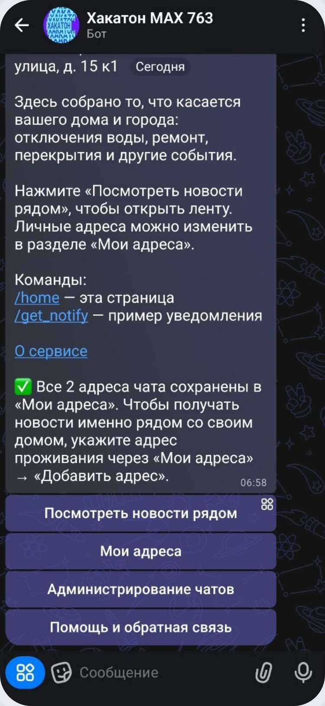
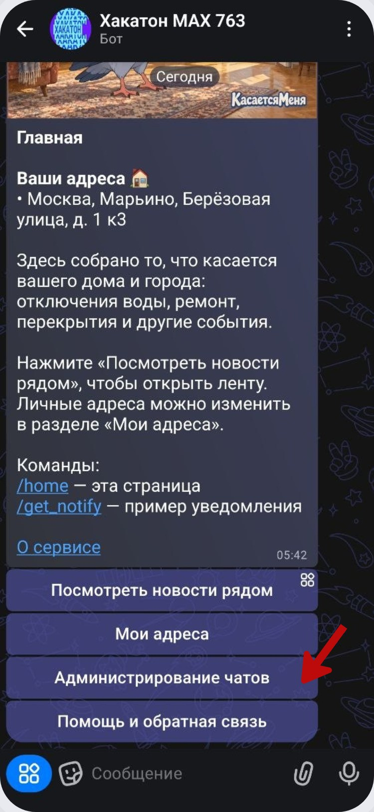
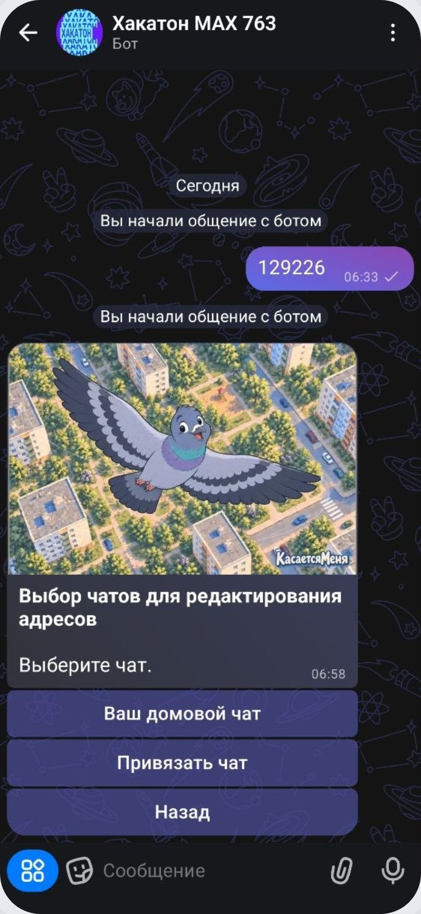
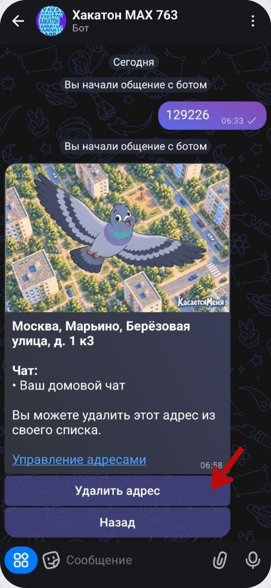

# Мои адреса и администрирование чатов

В сервисе есть два разных раздела: **«Мои адреса»** для личных адресов пользователя и **«Администрирование чатов»** для адресов групп, которыми вы управляете.

## Мои адреса

На главной нажмите **«Мои адреса»**.

Здесь отображаются сохранённые адреса. Можно открыть существующий адрес или добавить новый.

Если вы присоединились к чату, у которого несколько адресов, сервис может сохранить все адреса чата. Для персональных новостей рядом с домом добавьте собственный адрес проживания отдельно.

## Администрирование чатов

На главной нажмите **«Администрирование чатов»**.

Бот показывает чаты, доступные для редактирования, и отдельную кнопку **«Привязать чат»** для подключения нового.

Открыв адрес конкретного чата, администратор может удалить его из списка привязанных адресов.

Если нужно подключить новый чат, нажмите **«Привязать чат»**. После этого откроется стандартное меню выбора адреса с теми же четырьмя способами, что и при первом запуске.
