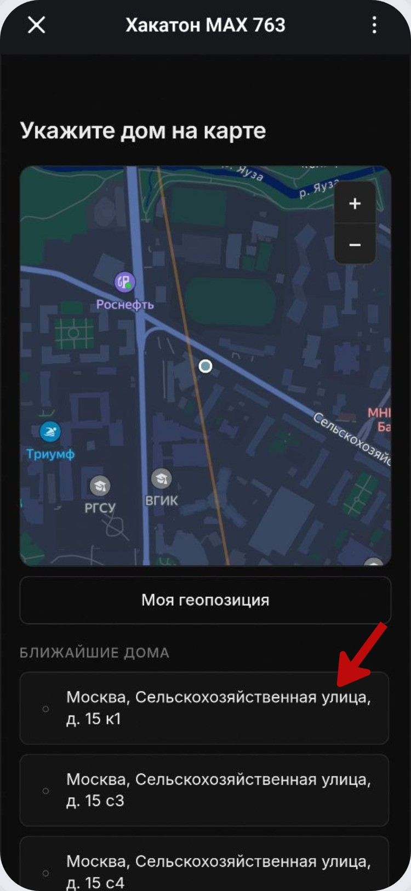
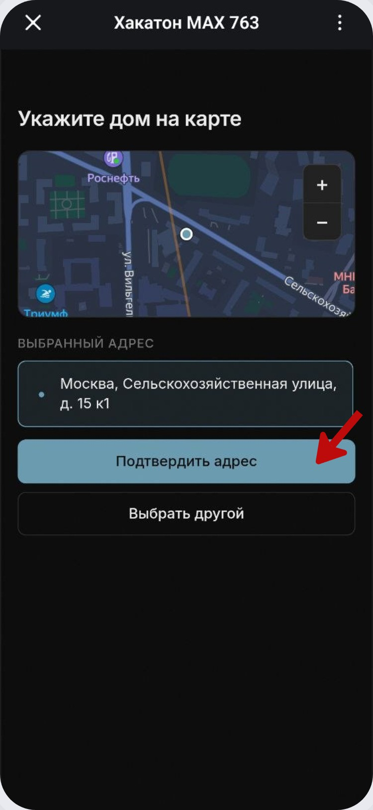
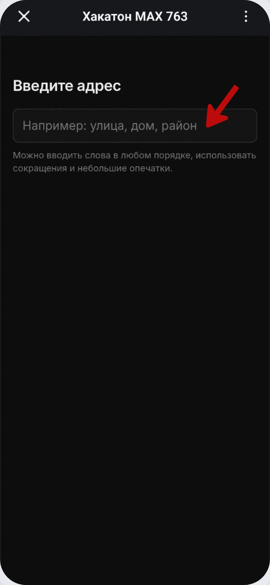
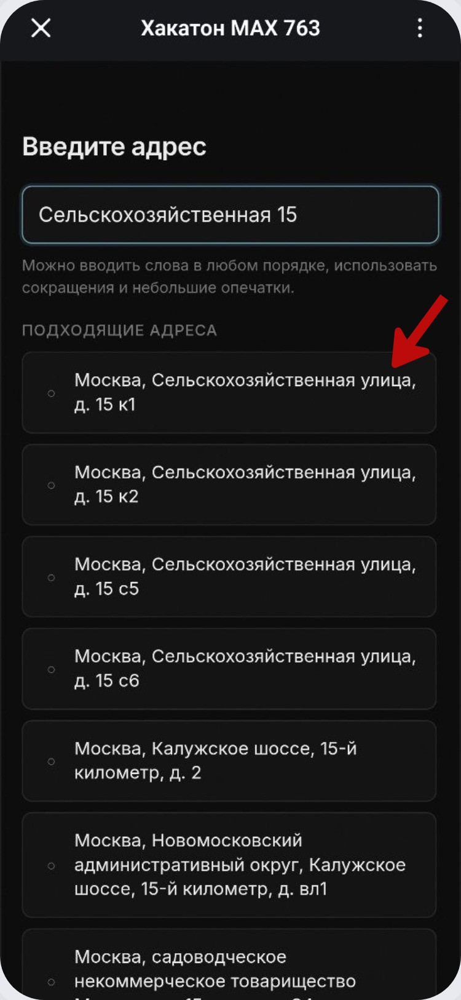
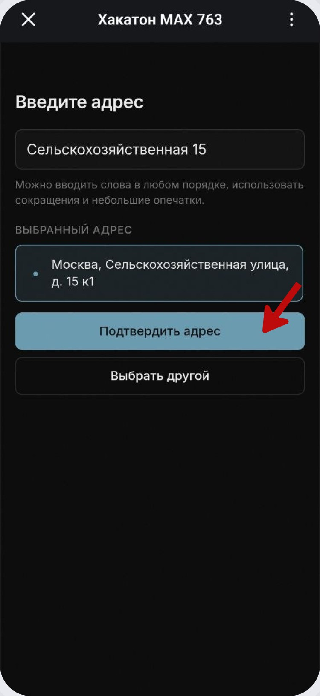

# Карта и ввод адреса текстом

## Выбор дома на карте

На главном экране выбора адреса нажмите **«Указать на карте»**.

В мини-приложении можно двигать карту и использовать свою геопозицию. Ниже отображаются ближайшие дома. Нажмите на подходящий адрес.

Проверьте выбранный адрес и нажмите **«Подтвердить адрес»**. Если дом выбран неверно, нажмите **«Выбрать другой»**.

## Ввод адреса текстом

Можно не искать дом вручную. Выберите **«Ввести текстом»** и начните вводить улицу, дом или район.

Сервис показывает подходящие варианты по мере ввода. Нажмите на нужный адрес.

После выбора ещё раз проверьте адрес и подтвердите его.

Оба способа приводят к одному результату: адрес сохраняется для дальнейшего подключения чата или личной ленты.
