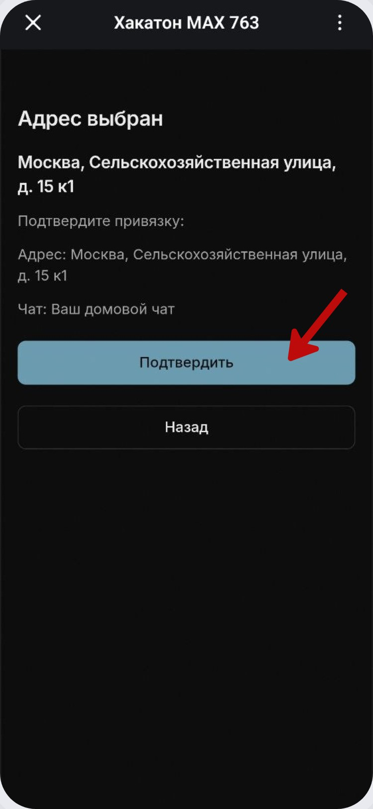
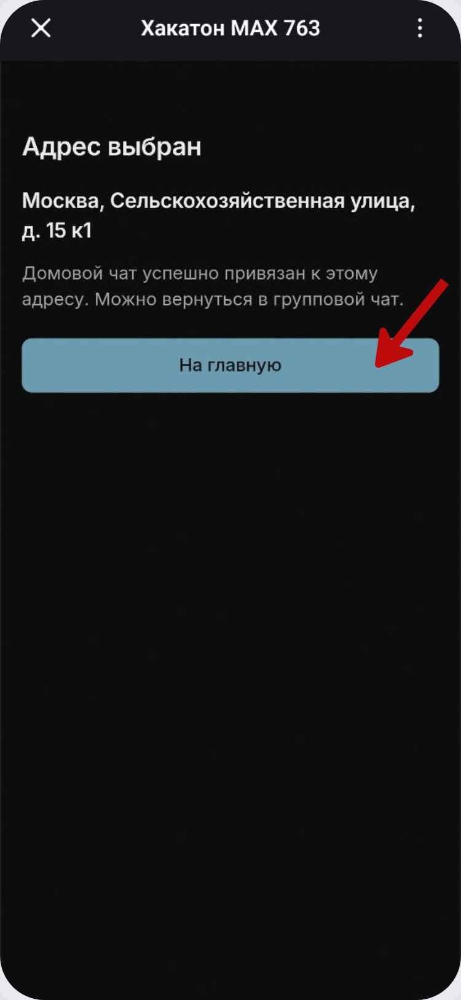
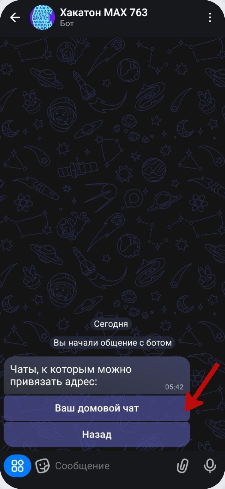
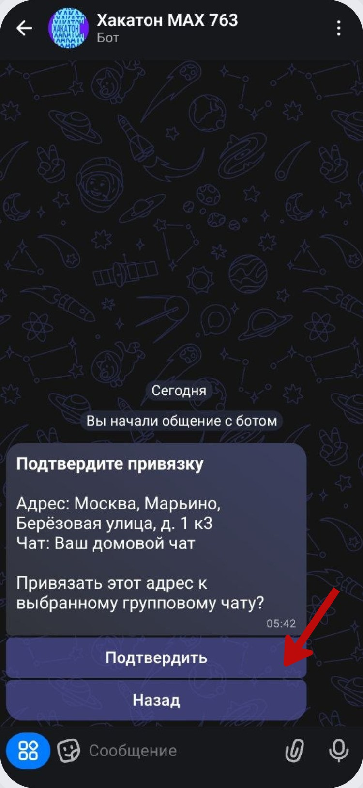
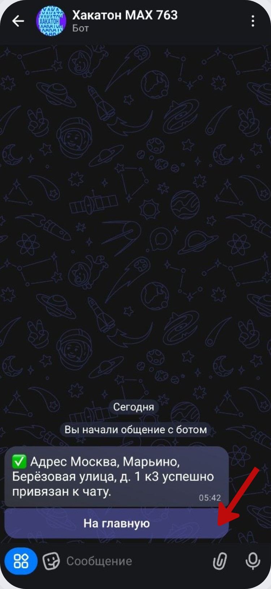
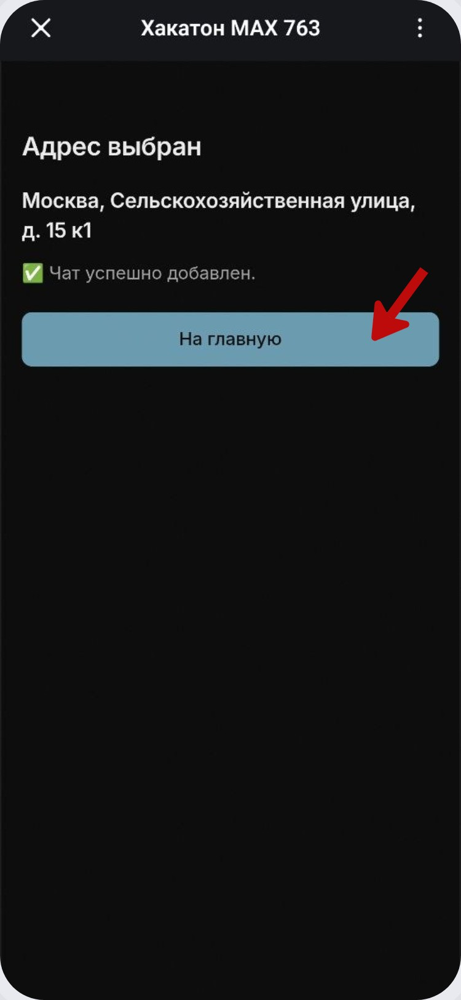

# Привязка адреса к домовому чату

После того как бот добавлен в группу и получил нужные права, вернитесь в личный диалог и продолжите подключение.

Если выбранный адрес уже связан с доступным чатом, сервис сразу показывает этот чат.

В мини-приложении нажмите на нужный чат.

Проверьте адрес и название чата, затем нажмите **«Подтвердить»**.

После успешной привязки появляется экран с кнопкой **«На главную»**.

Есть и тот же сценарий в личном чате с ботом. После проверки прав бот показывает группы, к которым можно привязать выбранный адрес.

Выберите группу и подтвердите действие.

Бот сообщит, что адрес успешно привязан.

Если подключение выполнялось через мини-приложение, отдельный экран также подтверждает успешное добавление чата.

После завершения в домовом чате появляется приветственное сообщение сервиса с адресом и кнопкой **«Присоединиться»** для жителей.

Адрес должен быть свободен от привязки к другому домовому чату. Если условия не выполнены, сначала исправьте настройки группы или выберите другой адрес.
