# Подготовка домового чата администратором

Если у выбранного дома ещё нет подключённого чата, сервис предлагает отправить приглашение администратору или продолжить подключение самостоятельно.

Кнопка **«Скопировать пригласительное сообщение»** создаёт готовый текст со ссылкой на подключение. Уникальная часть ссылки на скриншотах скрыта.

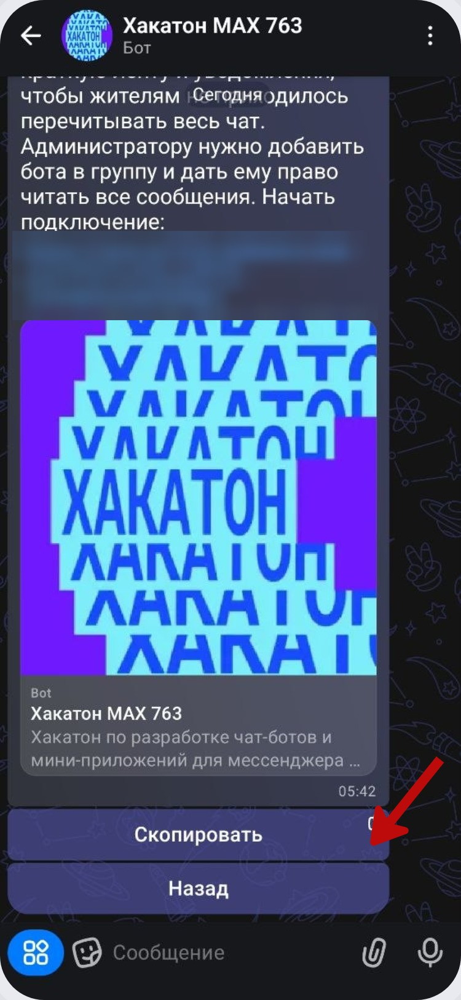

После копирования можно вернуться к экрану выбранного адреса и продолжить подключение из того же места.

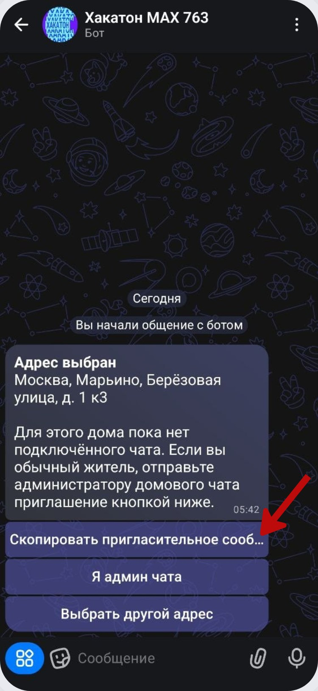

Тот же текст можно открыть в мини-приложении и скопировать оттуда.

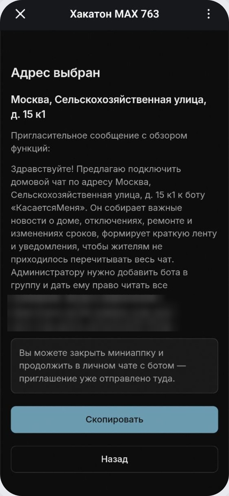

Если подключаете чат сами, выберите **«Я админ чата»**.

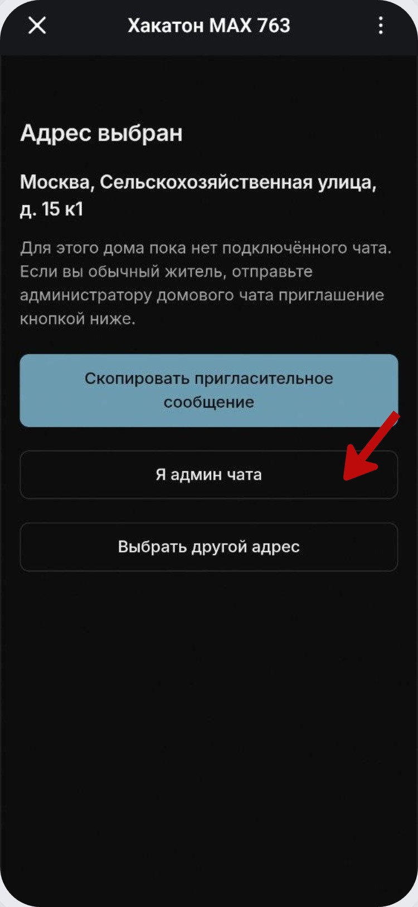

Бот объяснит два обязательных действия: добавить его в групповой чат и выдать право читать сообщения. После выполнения нужно вернуться в личный чат и нажать **«Проверить ещё раз»**.

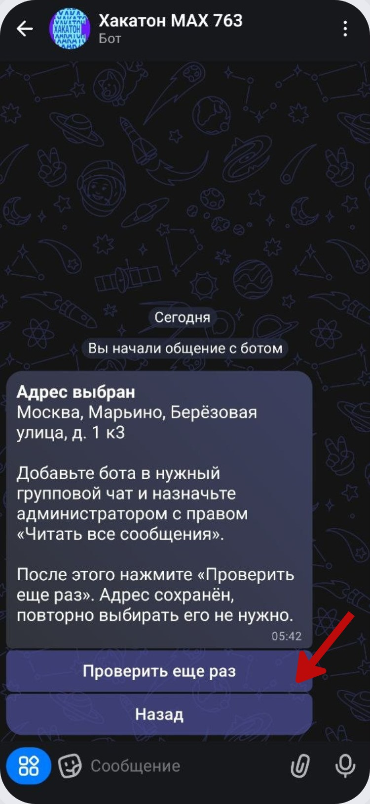

## Добавление бота в группу

Откройте информацию о домовом чате и нажмите **«Добавить участника»**.

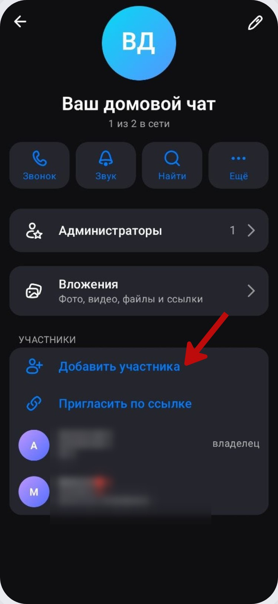

В списке участников используйте поиск.

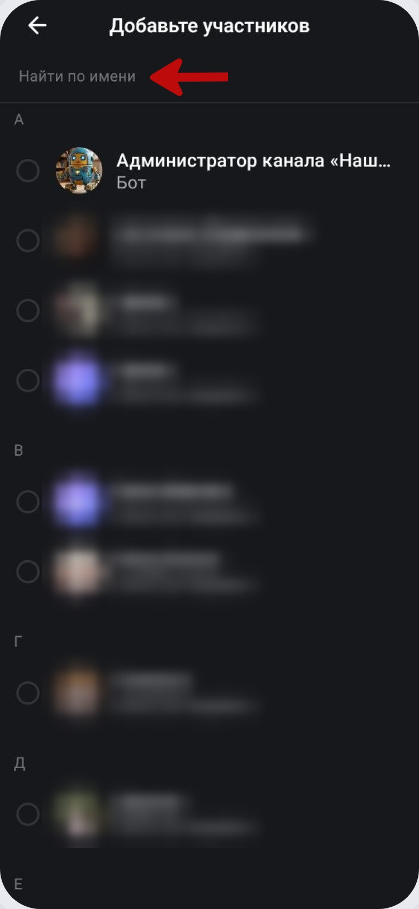

Найдите **«Хакатон MAX 763»** и выберите бота.

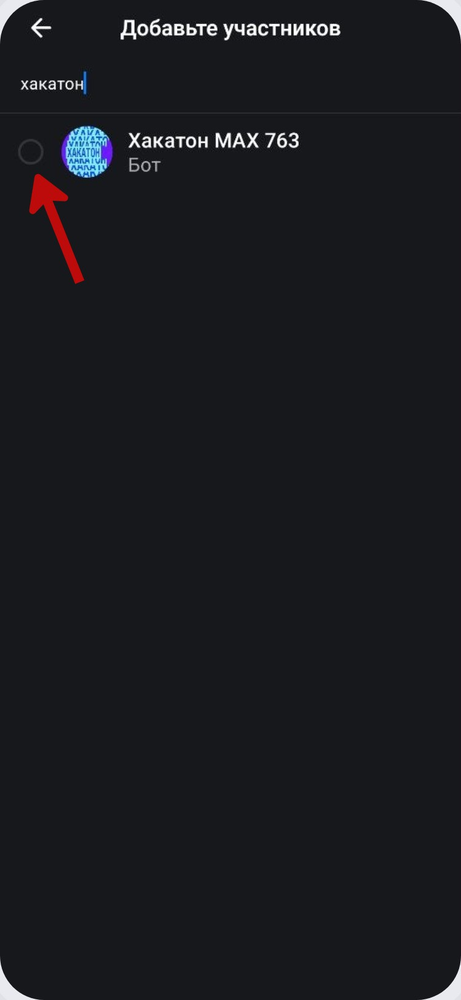

После выбора нажмите **«Добавить в чат»**.

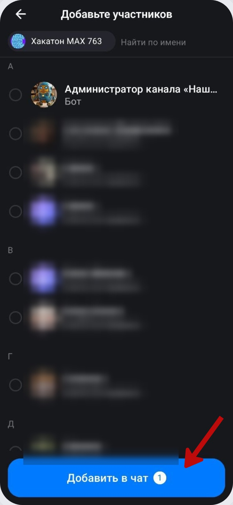

MAX может спросить, показывать ли новому участнику историю чата. Для работы сервиса выберите **«Показать»**.

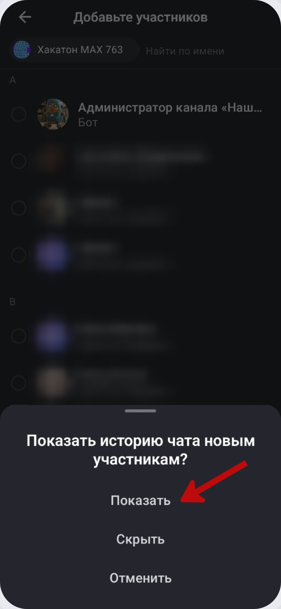

Если бот добавлен без нужных прав, в группе появится предупреждение.

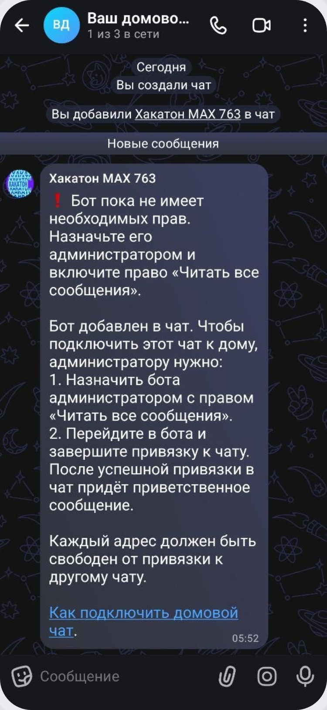

## Выдача прав администратора

Откройте раздел **«Администраторы»** в настройках группы.

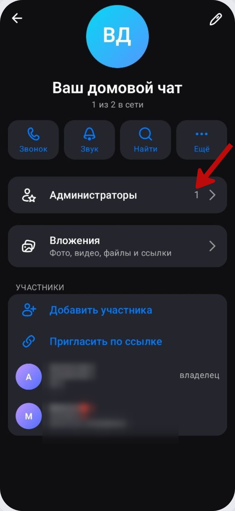

Нажмите **«Добавить администратора»**.

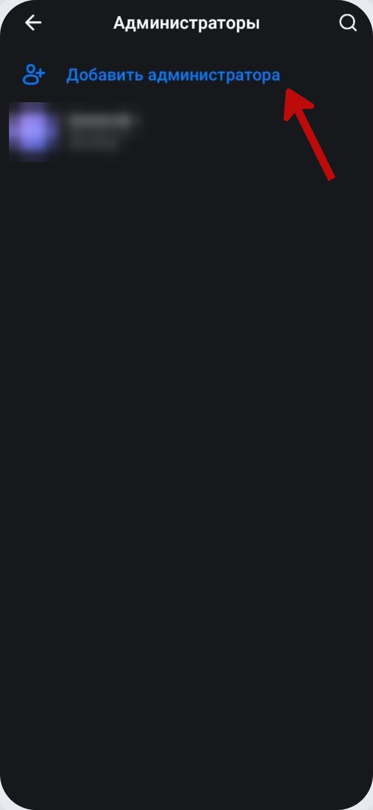

Выберите бота в списке.

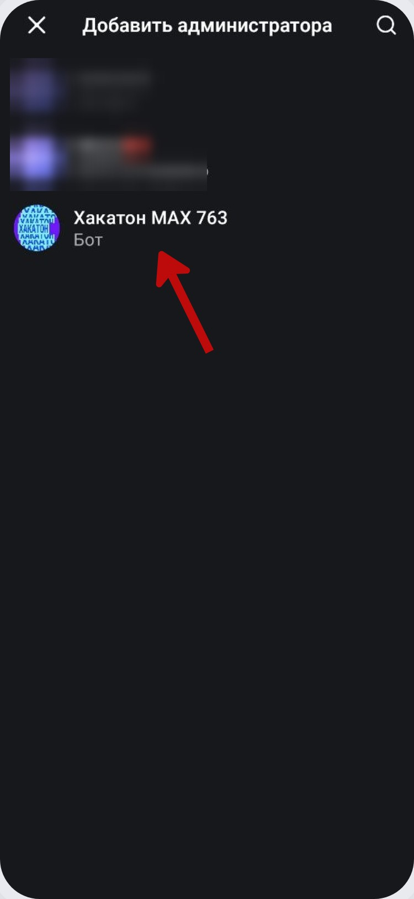

В правах администратора обязательно включите **«Читать сообщения»**, затем нажмите **«Назначить администратором»**.

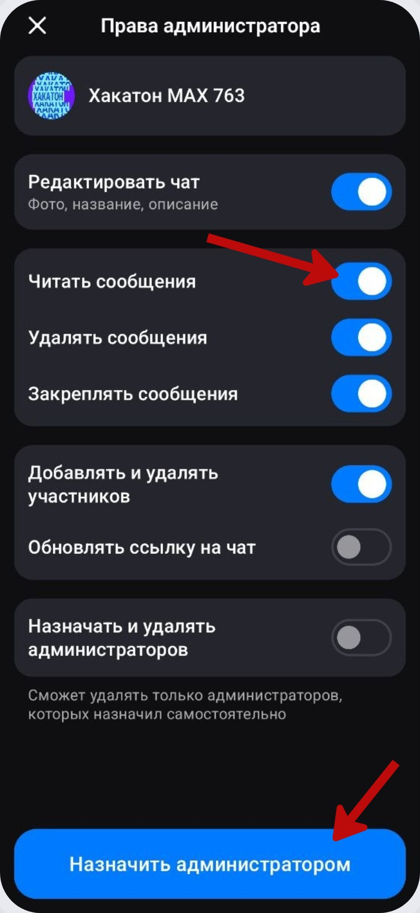

После этого вернитесь в личный чат с ботом и продолжите [привязку адреса к чату](admin-bind.md).
