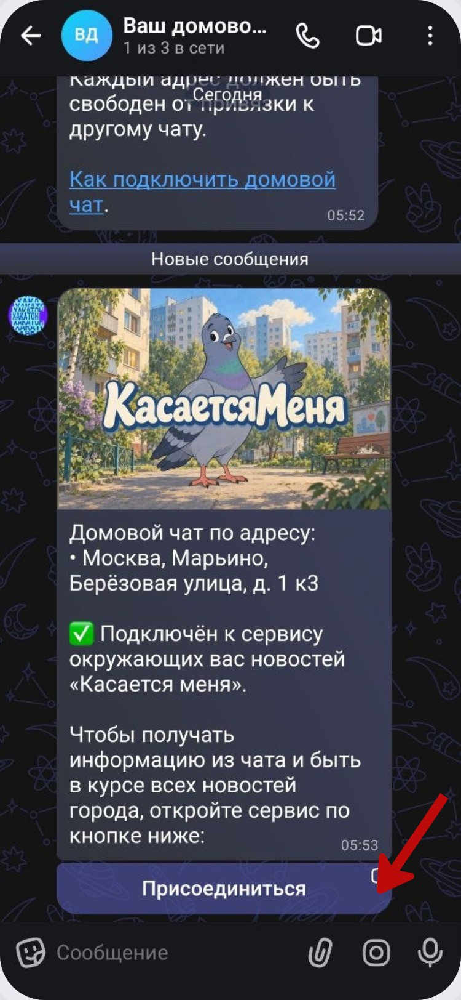

# Подключение обычного участника

После того как администратор связал домовой чат с адресом, в группе появляется сообщение сервиса. Жителю не нужно повторять административную настройку.

Нажмите **«Присоединиться»** под сообщением в домовом чате.

Бот сохранит адреса этого чата в **«Мои адреса»**. Если у чата несколько домов, будут добавлены все связанные адреса.

После этого можно вернуться на главную и пользоваться новостями, картой и уведомлениями. Для более точной персональной ленты укажите собственный адрес проживания через **«Мои адреса» → «Добавить адрес»**.
