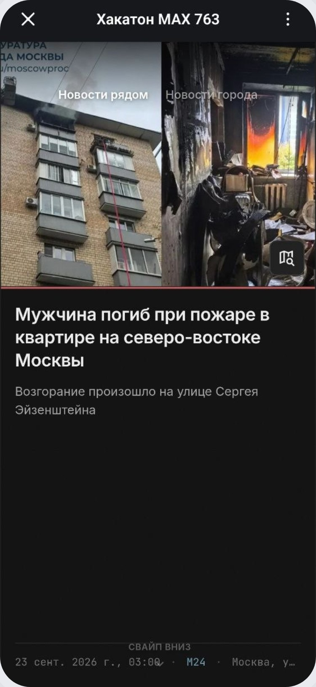
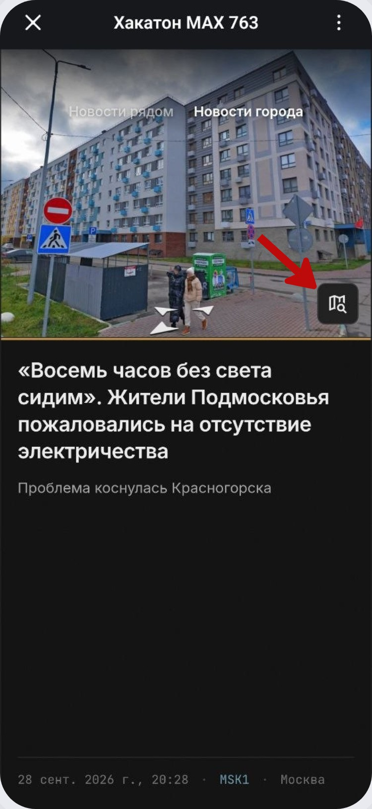
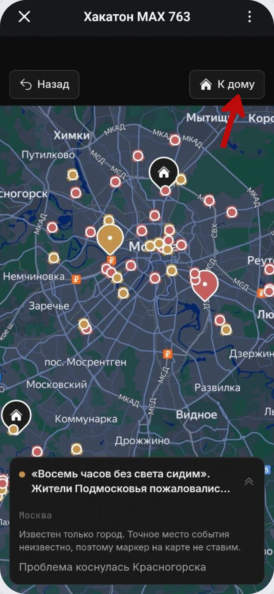
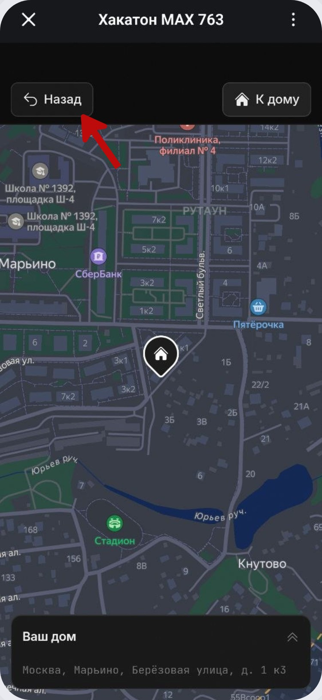
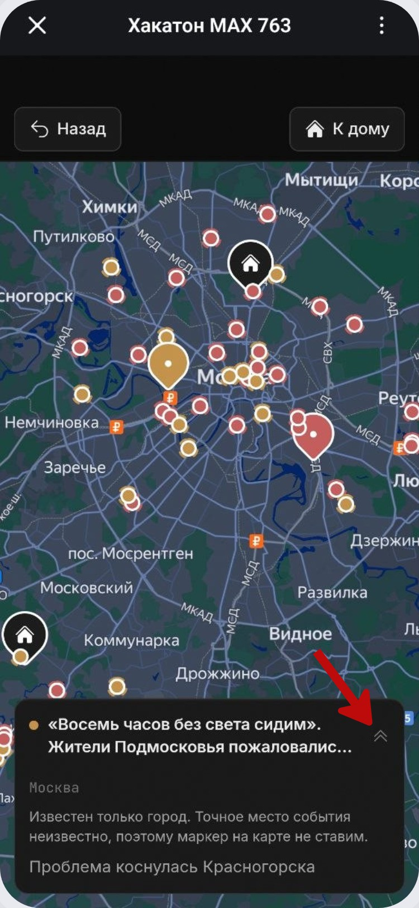

# Новости и карта событий

Кнопка **«Посмотреть новости рядом»** открывает мини-приложение с двумя лентами: новости рядом с выбранным адресом и общегородские новости.

Во вкладке **«Новости рядом»** показываются события, которые относятся к ближайшей территории.

Во вкладке **«Новости города»** можно переключиться на события более широкого масштаба.

На карте события отмечены маркерами. Карточка выбранного события показывает заголовок, место и краткое описание.

Карта умеет фокусироваться на вашем доме. Кнопка **«Назад»** возвращает к предыдущему экрану, а **«К дому»** переводит карту к сохранённому адресу.

Карточку события внизу карты можно сворачивать, чтобы освободить место для просмотра маркеров.

