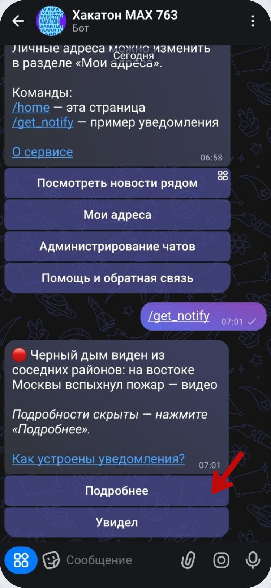
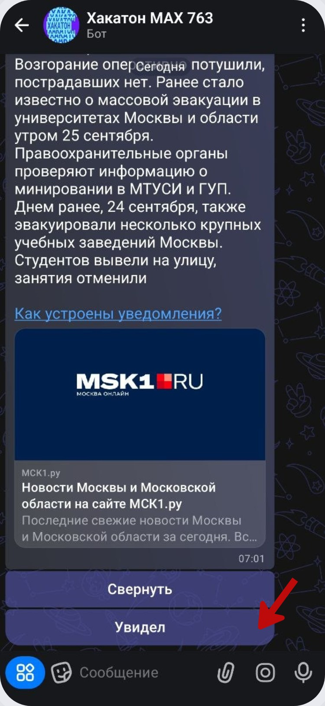

# Уведомления

Сервис присылает отдельные уведомления о важных событиях. Для демонстрации того же интерфейса можно использовать команду `/get_notify`.

Сначала уведомление приходит в компактном виде: краткий текст, ссылка с объяснением механики и две кнопки - **«Подробнее»** и **«Увидел»**.

Нажмите **«Подробнее»**, чтобы развернуть сообщение. В расширенной версии отображается полный текст и карточка источника. Кнопка меняется на **«Свернуть»**.

Кнопка **«Увидел»** подтверждает просмотр уведомления. После подтверждения бот возвращает пользователя на главную страницу.

