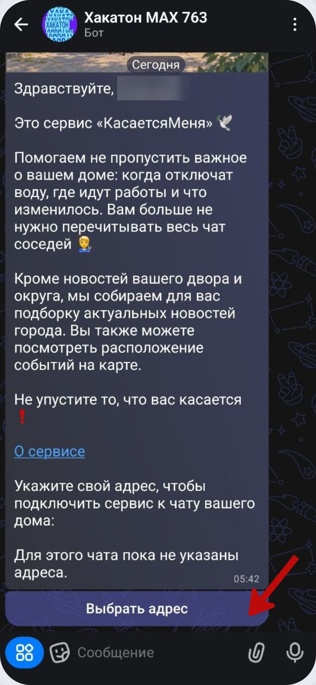

# Первый запуск и главная

После начала диалога бот кратко объясняет, что собирает новости о доме и городе, показывает события на карте и присылает важные уведомления. Для начала работы нужно указать адрес.

Нажмите **«Выбрать адрес»**. Откроется меню с четырьмя способами: выбрать адрес из списка, указать почтовый индекс, выбрать дом на карте или ввести адрес текстом.

После настройки основной экран становится главной точкой навигации. Здесь отображаются сохранённые адреса, а ниже находятся кнопки новостей, адресов, администрирования чатов и помощи.

Если к подключённому чату относится несколько домов, бот может сохранить сразу несколько адресов. При этом для персональной ленты рекомендуется отдельно указать свой адрес проживания через **«Мои адреса»**.

Для возврата из меню выбора адреса используйте **«← Назад»**. Эта кнопка возвращает в предыдущий раздел, а не запускает выбор заново.

Дальше можно выбрать удобный способ указания дома:

- [по списку](address-list.md);
- [по почтовому индексу](address-postcode.md);
- [на карте или текстом](address-map-text.md).
